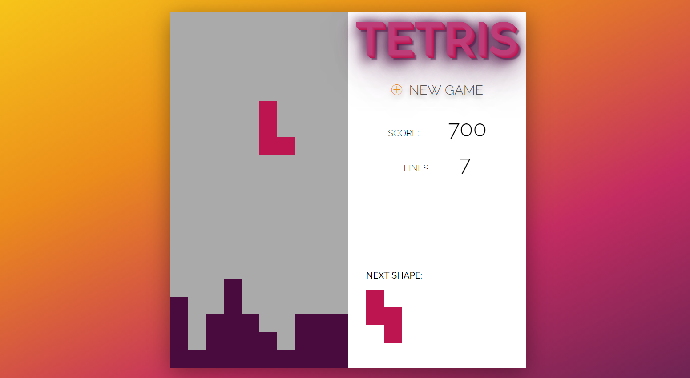

<!-- PROJECT NAME -->

# Tetris

Web browser game based on the famous videogame Tetris. Having fun with JavaScript ES6!

<!-- TABLE OF CONTENTS -->

## Table of Contents

- [About the Project](#about-the-project)
  - [Project Structure](#project-structure)
  - [Instructions](#instructions)
  - [Controls](#controls)
- [Getting Started](#getting-started)
  - [Prerequisites](#prerequisites)
  - [Installing](#installing)
- [Usage](#usage)
- [Built With](#built-with)
- [Authors](#authors)
- [License](#license)
- [Contact](#contact)
- [Acknowlegments](#acknowledgements)

## About the Project

This project has been focused to learn some new cool techniques programming in JavaScript ES6. The purpose is to learn more in depth the new functionalities of ECMA script v6 and enjoying to develop a classic videogame to make this a fun learning thing!

This project uses a full HTML/CSS aproximation and I've not used any canvas to draw the tetrominoes.

**Notes**

> ATENTION: This web browser-game is not responsive. It was not intended to play in a mobile device.

> The code contains Spanish comments to understand its functionality.

### Project Structure

The project has been developed with a classic folder distribution:

- **css**: all the styles of the project are inside this folder.
- **js**: The important file is located here. I've developed the _app.js_ taking in mind a MVC aproximation.
- _index.html_: our web browser-game. Just HTML code.

### Instructions

To play this Tetris version game, you need to play it on a desktop or laptop web browser. To start a game, click on _New Game_ button in the right side. The game will start inmediately. Game will Over if the tetrominoes block will reach the top of the panel.

### Controls

- :arrow_left:: move left the current tetrominoe.
- :arrow_right:: move right the current tetrominoe.
- :arrow_up:: turn the current tetrominoe.
- :arrow_down:: move down the current tetrominoe.

- Push the _spacebar_ or click the _New Game_ button to restart a new game.

<!-- GETTING STARTED -->

## Getting Started

To setting up the project locally you can download a copy of this project clicking on the _Clone or download_ and then _Download ZIP_, or you can just enter in the webpage and having fun playing some tetris games.

### Prerequisites

There is no prerequisites to play a Tetris game!

### Installing

No need to install!

<!-- USAGE -->

## Usage

Feel free to use this code (see more on [license](#license)).

## Built with

This project is plugin free. You don't need nothing to run it!

<!-- CONTRIBUTING -->

## Contributing

Contributions are what make the open source community such an amazing place to learn, inspire and create. Any contributions you make are **greatly appreciated**.

1. Fork the project.
2. Create your Feature Branch: `git checkout -b feature/example-name`.
3. Commit your changes: `git commit -m 'Add some features'`.
4. Push to the Branch: `git push origin feature/example-name`.
5. Open a Pull Request.

<!-- AUTHORS -->

## Authors

- **Guillem Martí**: built and documentation.

<!-- LICENCE -->

## License

Keep in mind that the code of this project is open source, but not the Tetris brand.

<!-- CONTACT -->

## Contact

Guillem Martí - [@guimarbe](https://twitter.com/guimarbe)

<!-- ACKNOWLEDGEMENTS -->

## Acknowledgements

- [atom](https://atom.io/)
- [Emmet](https://emmet.io/)
- [JavaScript ES6 documentation](https://developer.mozilla.org/en/docs/Web/JavaScript)
